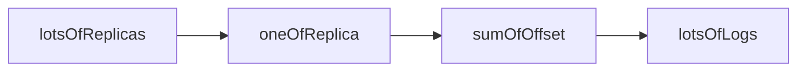
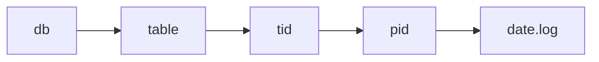
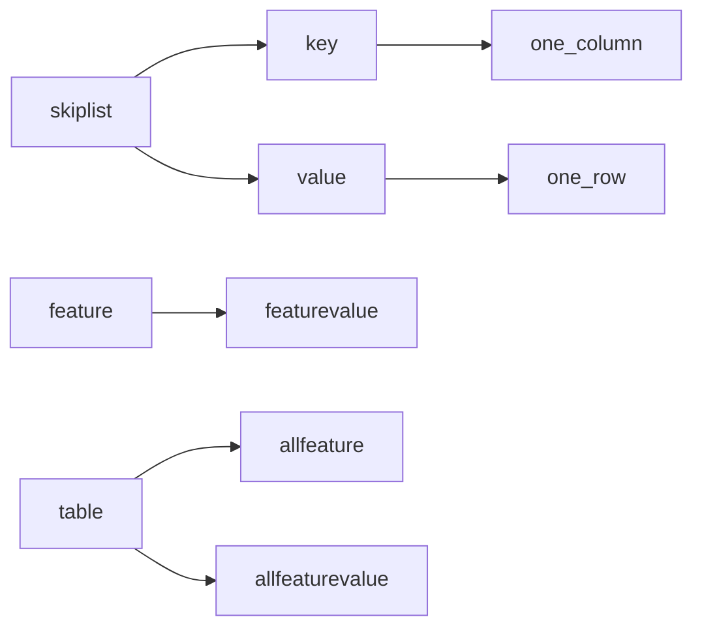
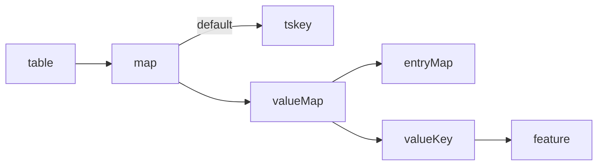
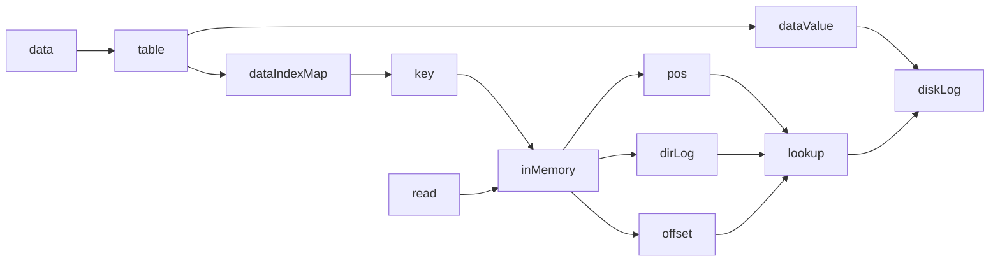
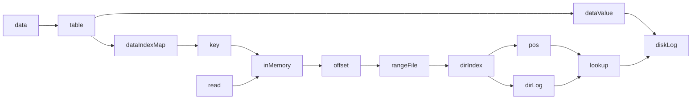
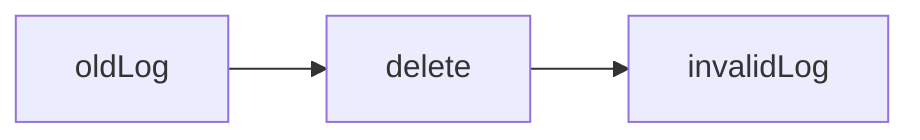

# 架构设计

## 数据模块

### 处理的数据

- 神经网络参数
- 传统mysql数据

### 数据模型

- kv
- row
- Block
- index

### 数据检验

- 大数据，大对象检验辅助信息合法性
- 每一条的数据检查数据本身内容

## 模块

- 思想：要有组件的思维，就和storm的bolt一样
- log 
- replica
- base
- storage

## 功能要求

- 高性能
- 高可用
- 分布式
- 内存+磁盘！！！
- 内存负责计算模块内容
- 磁盘负责保存数据
- schema可以动态扩展

## 性能要求

- 写一条记录
- 读一条记录
- 改一条记录
- 删一条记录
- 写大量记录
- 读大量记录
- 改大量记录
- 删大量记录
- 备份
- 恢复
- 压缩
- 垃圾回收

## 内存设计

- 跳表保存索引

## 日志设计

- 数据流scribe系统：https://github.com/facebookarchive/scribe

- ```
  table {
      LogController
  }
  LogController {
      vector<string> dir
      LogInfo meta
      map< string, logIndex>
      
  }
  LogInfo {
      uint64_t currentOffset 
      sort_map < maxOffset, index.name > 
  }
  LogIndex {
      sort_map< uint64_t, uint64_t> LogIndex = offset, file_pos
  }
  ```

### 日志目录

- log-dir

  - meta.info
  - data-dir
    - 000000000000.index
    - 000000000000.log
    - 000000000001.index
    - 000000000001.log


### 日志格式

- 偏移量
- 大小
- 消息


### 日志存储

- 采用protobuf算法varints
  - https://blog.csdn.net/hellochenlu/article/details/51395988
- 

## 存储设计

### 表设计

- 路径：db/table_name/
- table_meta


#### 插入数据
```flow
st=>start: Put
check1=>operation: check Key
insert1=>operation: insert Key
check2=>operation: check TS
insert2=>operation: insert TS
check3=>operation: check Value
insert3=>operation: insert Value

cond1=>condition: Have it or not?
cond2=>condition: Have it or not?
cond3=>condition: Have it or not?

create1=>operation: new Key
create2=>operation: new TS
create3=>operation: new Value

e=>end: End


st->check1->cond1
cond1(yes)->insert1
cond1(no)->create1
create1->insert1->e

insert1->check2
check2->cond2
cond2(yes)->insert2
cond2(no)->create2
create2->insert2->e

insert2->check3
check3->cond3
cond3(yes)->insert3
cond3(no)->create3
create3->insert3->e

insert3->e
```


#### 获取数据

```flow
st=>start: Get
check1=>operation: check Key
check2=>operation: check TS
check3=>operation: check Value

cond1=>condition: Have it or not?
cond2=>condition: Have it or not?
cond3=>condition: Have it or not?

none=>operation: return none
value=>operation: return value

e=>end: End

st->check1->cond1
cond1(yes)->check2->cond2
cond2(yes)->check3->cond3
cond3(yes)->value->e
cond1(no)->none->e
cond2(no)->none->e
cond3(no)->none->e


```

### 语法设计

- 创建一张表
  - create table_name ts_name,uint_64,isIndex col_name,type,isIndex  col_name,type,isIndex
- 写入一条数据
  - insert table_name key,key,key value,value,value
- 读一条数据
  - select table_name key value start_time end_time
- 删除一条数据
  - delete table_name key value
- 更新一条数据
  - update table_name key value new_value

### 中间存储结构

```
table {
    skiplist< keyEntry, valuesEntry > 
    Index
}
keyEntry {
    name
    type
    size
}
valuesEntry {
    skiplist < timestamp, valueSingleEntry >
    size
    count
}
valueSingleEntry {
    Index
}
Index {
    skiplist< value, offset >
}
```
### 方案一-参考spark设计

#### 文档

- http://spark.apache.org/docs/latest/sql-getting-started.html
- http://spark.apachecn.org/#/docs/7
- 源码分析
  - spark源码分析：http://www.cnblogs.com/fxjwind/p/3522473.html
  - storm源码分析：https://blog.csdn.net/xiaolang85/article/details/38404327
- 表转流式：https://www.jianshu.com/p/2673a6e4254f
- Structured Streaming Programming Guide：http://spark.apache.org/docs/latest/structured-streaming-programming-guide.html
- spark官网全是讲api和如何使用api，没有原理对应代码的一个映射



### 方案二-参考kafka设计

#### 文档

- https://engineering.linkedin.com/kafka/benchmarking-apache-kafka-2-million-writes-second-three-cheap-machines
- 源码分析
  - 目录介绍：https://blog.csdn.net/lizhitao/article/details/37911993
  - 深入分析：https://www.jianshu.com/p/aa274f8fe00f

```
A topic is a category or feed name to which records are published. Topics in Kafka are always multi-subscriber; that is, a topic can have zero, one, or many consumers that subscribe to the data written to it.
topic is table
each log is one row
table own schema
table {
    schema
    partition
}
partition {
	
    Tuple an ordered, immutable sequence of records // 跳表 key是时间
    uint64_t offset
}
```

### 方案三-综合思考的结果




### 数据流动方案

#### 方案一



#### 方案二



### Compaction

- 参考kafka方案一
  - 要删除无效的日志，然后生成新的日志文件
  - 日志压缩前后
  - offset不变，但是不再连续
  - 文件物理位置会变化



## 技术优化点

- 内存映射：https://blog.csdn.net/mg0832058/article/details/5890688
- bloom：https://blog.csdn.net/mg0832058/article/details/5890688
- key前缀共享：https://blog.csdn.net/sparkliang/article/details/8635821
- 粗糙集索引Rough Set Index：
- 零拷贝ZeroCopy：https://developer.ibm.com/articles/j-zerocopy/
- 计算异或值：巧用异或值的唯一性质，提高通信效率，参考Storm Acker的机制
- LMAX Disruptor Queue：https://lmax-exchange.github.io/disruptor/files/Disruptor-1.0.pdf
- write-ahead-log与append-only-file：https://my.oschina.net/blacklands/blog/875179
- lock-free skip list：https://stackoverflow.com/questions/3479043/how-to-implement-lock-free-skip-list
- Reed-Solomon：https://www.jianshu.com/p/8208aad537b
- wiscKey的key-value 分离：https://www.jianshu.com/p/1b438f850844
- 引用计数法的对日志的数据进行定位
- base 128 varints编码：https://developers.google.cn/protocol-buffers/docs/encoding

# 代码实现

## 数据结构

### 基本类型

- map 和 skiplist
- 底层用skiplist，外部在用map构成索引

### 调研结果

- map结构简单，容易操作
- hashmap
  - https://en.wikipedia.org/wiki/Hash_table
- sortmap vs unsortedmap
  - http://supercomputingblog.com/windows/ordered-map-vs-unordered-map-a-performance-study/
- 查找O(1)
- 跳表
  - https://en.wikipedia.org/wiki/Skip_list
- 树
- TreeMap、HashMap、ConcurrentSkipListMap比较
  - https://blog.csdn.net/bigtree_3721/article/details/51290960

## 数据压缩

### snappy

- https://github.com/google/snappy

## 代码设计

### base

- compression.h
- compression.cc
  - 所有的压缩算法实现
- string_ice.h
- string_ice.cc
  - 针对ice数据库的所有字符串操作
- skiplist.h
- skiplist.cc
- map.h
- map.cc
- hashmap.h
- hashmap.cc
- slice.h
- slice.cpp
  - 底部线程安全核心结构
- index.h
- index.cc
- coding.h
- coding.cc
  - 加密解码schema，操作
- gc.h
- gc.cc
  - 垃圾回收，要考虑ttl等因素

### table

- table.h
- table.cc

### logger

- log_reader.h
- log_reader.cc
- log_writer.h
- log_writer.cc

### rpc

- ice_receive.h
- ice_receive.cc
- ice_send.h
- ice_send.cc

### proto

- table.proto
- tablet.proto

### io

- 

# 改进点

- schema 用 json格式